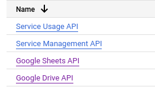
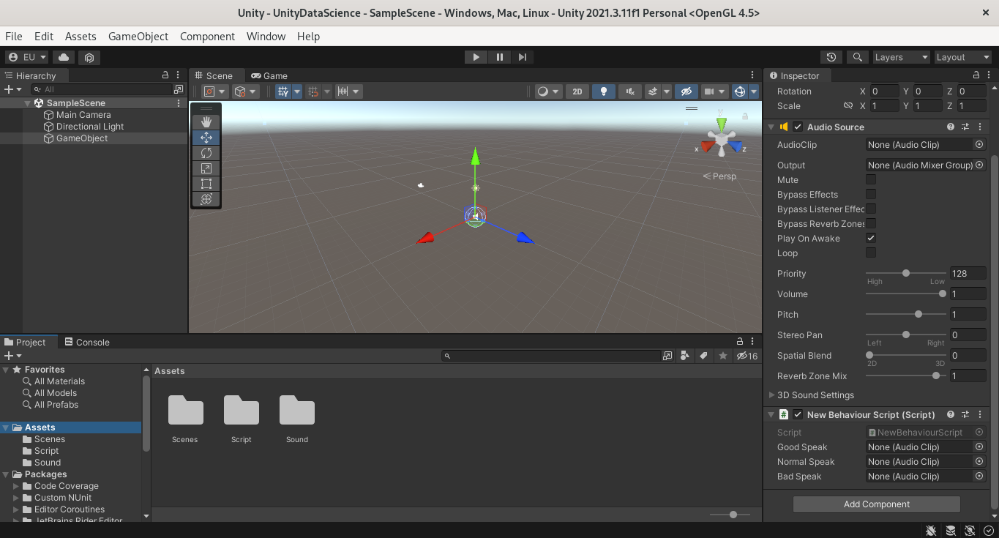
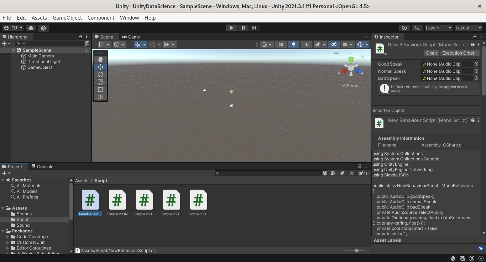
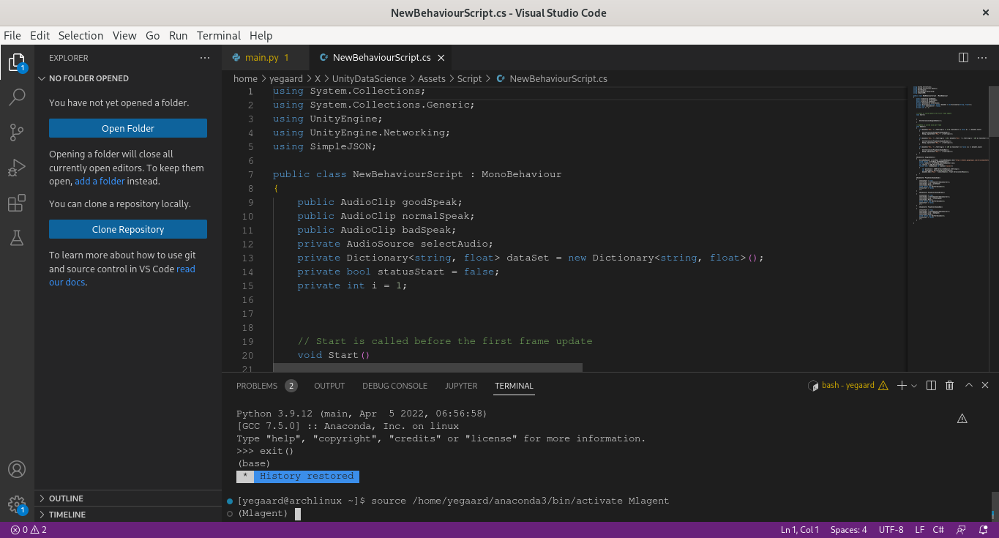

# АНАЛИЗ ДАННЫХ И ИСКУССТВЕННЫЙ ИНТЕЛЛЕКТ [in GameDev]
Отчет по лабораторной работе #2 выполнил(а):
- Усков Егор Дмитриевич
- РИ000024
Отметка о выполнении заданий (заполняется студентом):

| Задание | Выполнение | Баллы |
| ------ | ------ | ------ |
| Задание 1 | * | 60 |
| Задание 2 | # | 20 |
| Задание 3 | # | 20 |

знак "*" - задание выполнено; знак "#" - задание не выполнено;

Работу проверили:
- к.т.н., доцент Денисов Д.В.
- к.э.н., доцент Панов М.А.
- ст. преп., Фадеев В.О.

[](https://nodesource.com/products/nsolid)

[](https://travis-ci.org/joemccann/dillinger)


ЛАБОРАТОРНАЯ РАБОТА. КОНСТРУКЦИИ ЯЗЫКА PYTHON НА ПРИМЕРЕ
РЕАЛИЗАЦИИ ЛИНЕЙНОЙ РЕГРЕССИИ

## Цель работы
Познакомиться с программными средствами для организции передачи данных между инструментами google, Python и Unity.

## Задание 1
### Реализовать совместную работу и передачу данных в связке Python
- Google-Sheets – Unity. При выполнении задания используйте видео-материалы и
исходные данные, предоставленные преподавателя курса.
- В облачном сервисе google console подключить API для работы с google
sheets и google drive.



- Реализовать запись данных из скрипта на python в google-таблицу. Данные
описывают изменение темпа инфляции на протяжении 11 отсчётных периодов, с
учётом стоимости игрового объекта в каждый период.
```
import gspread
import numpy as np
gc = gspread.service_account(filename='unitydatascience-364809-75d960e3236e.json')
sh = gc.open('UnitySheets')
price = np.random.randint(2000, 10000, 11)
mon = list(range(1, 11))
i = 0
while i <= len(mon):
    i += 1
    if i == 0:
        continue
    else:
        tempInf = ((price[i-1]-price[i-2])/price[i-2])*100
        tempInf = str(tempInf)
        tempInf = tempInf.replace('.', ',')
        sh.sheet1.update(('A' + str(i)), str(i))
        sh.sheet1.update(('B' + str(i)), str(price[i-1]))
        sh.sheet1.update(('C' + str(i)), str(tempInf))
        print(tempInf)
```


- Создать новый проект на Unity, который будет получать данные из google-
таблицы, в которую были записаны данные в предыдущем пункте.



- Написать функционал на Unity, в котором будет воспризводиться аудио-
файл в зависимости от значения данных из таблицы.





## Выводы
Реализовал совместную работу и передачу данных в связке Python
- Google-Sheets – Unity, пользуясь видео-материалами, предоставленными преподавателями курса.

| Plugin | README |
| ------ | ------ |
| Dropbox | [plugins/dropbox/README.md][PlDb] |
| GitHub | [plugins/github/README.md][PlGh] |
| Google Drive | [plugins/googledrive/README.md][PlGd] |
| OneDrive | [plugins/onedrive/README.md][PlOd] |
| Medium | [plugins/medium/README.md][PlMe] |
| Google Analytics | [plugins/googleanalytics/README.md][PlGa] |

## Powered by

**BigDigital Team: Denisov | Fadeev | Panov**
